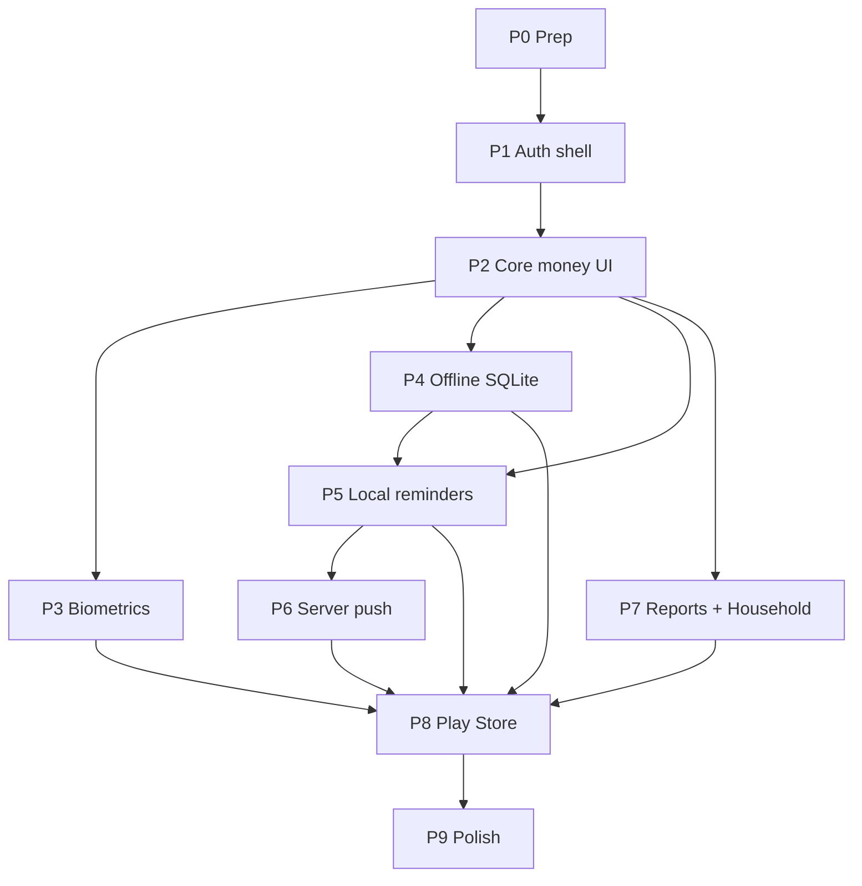

# CashTrail Mobile — Phase-by-Phase Build Plan

**Product:** CashTrail (My-Wallet)  
**Source:** `REACT_NATIVE_PLAYSTORE_RESEARCH.md`  
**Status:** Build roadmap (implementation not started for React Native)  
**Date:** 2026-07-29  
**Stack decision:** **Expo (React Native) + existing Django API on Railway**  
**Package id:** `com.cashtrail.app`

---

## How to use this file

Ship mobile in **ordered phases**. Each phase must be **demoable on a real Android device / emulator** before starting the next.

```
P0 Prep ──► P1 Shell + Auth ──► P2 Core money UI ──► P3 Biometrics
                                                         │
                                                         ▼
                              P4 Offline (SQLite) ──► P5 Local reminders ──► P6 Push + backend jobs
                                                         │
                                                         ▼
                              P7 Reports + Household ──► P8 Play Store launch ──► P9 Polish / growth
```

**Rules across all phases**

- Django remains the **source of truth** after sync — do not fork balance math into the app.
- Reuse API contracts from the web app (`/api/auth`, wallets, txs, payables, receivables, household).
- Never send raw amounts / invite codes to PostHog.
- Offline creates **must** use `client_mutation_id` (already on backend — migration `0010`).
- Household dual-link / pot edits stay **online-only** until a later L2 offline phase (out of P4 scope).
- Prefer CashTrail visual language (forest theme tokens, clear hierarchy, mobile-first lists).
- **Android UI must look cooler than the web PWA** — same brand, richer native feel (see **Android UI bar** below).

**Already done on web (reuse / port, don’t rebuild from zero)**

| Piece | Where |
| --- | --- |
| Idempotent txs (`client_mutation_id`) | `backend` migration `0010` |
| Offline L0+L1 outbox pattern | `frontend/src/offline/` (IndexedDB) — port logic to `expo-sqlite` |
| Session restore when offline | `AuthContext` + `cashtrail_user` cache |
| PostHog event names | `posthawk.md` / `frontend/src/lib/analytics.ts` |

---

## Android UI bar (applies to every phase)

Goal: Play Store CashTrail should feel like a **polished Android finance app**, not “the website inside a shell.”

| Do | Don’t |
| --- | --- |
| Keep CashTrail brand (logo, greens, clear money hierarchy) | Copy web CSS 1:1 into RN |
| Native bottom tabs, smooth sheet modals, crisp list rows | Browser-like scroll chrome / dense desktop layouts |
| Hero balance with strong typography + subtle motion (2–3 intentional animations) | Purple glow / generic “AI SaaS” look |
| Comfortable tap targets, press feedback, safe areas / edge-to-edge | Tiny web buttons that feel awkward on phone |
| Light depth (surfaces, soft elevation) that fits the forest theme | Flat white boxes with no hierarchy |
| Screenshots-ready Home + Wallets + Add money by end of **P2** | Ship a “temporary ugly” UI and polish only at the end |

**UI exit check:** on a mid-range Android phone, Home should look **demo-worthy** — cooler and more native than the current PWA.

---

## Phase overview


| Phase | Name | Outcome | Effort (1 RN + API) |
| --- | --- | --- | --- |
| **P0** | Prep & foundations | Repo, Expo app, API URL, Play package id locked | ~2–4 days |
| **P1** | Shell + Auth | Login/signup, JWT in SecureStore, tab shell | ~1 week |
| **P2** | Core money UI | Home, wallets, add money — **cooler Android-native look** | ~1.5–2 weeks |
| **P3** | Biometric privacy lock | Amounts masked until fingerprint / PIN | ~1 week |
| **P4** | Offline L0+L1 | Open offline, queue txs, sync when online | ~1.5–2 weeks |
| **P5** | Local due-date reminders | Payable / receivable local notifications | ~1 week |
| **P6** | Server push | Device tokens + daily Django → FCM/Expo push | ~1–1.5 weeks |
| **P7** | Reports + Household parity | Forecast/reports + household hub feature-complete vs web | ~2–3 weeks |
| **P8** | Play Store launch | Listing, AAB, closed test → production | ~1–2 weeks |
| **P9** | Polish & growth | UI polish pass, ASO, PostHog, crashes | Ongoing |

**Critical path to a useful private APK:** P0 → P1 → P2  
**Critical path to “research goals” (bio + offline + alerts):** … → P3 → P4 → P5  
**Critical path to public Play Store:** … → P6 (optional for MVP store) → P7 (can be thinner) → P8  

Suggested minimum for first Play **closed test:** **P0–P5** (+ thin Settings).  
Suggested minimum for **production:** **P0–P6** + privacy policy + Data safety; Household can land in P7 shortly after.

---

## Phase 0 — Prep & foundations


| | |
| --- | --- |
| **Goal** | Lock package id, scaffold Expo app, wire to Railway API |
| **Depends on** | Research signed off; Django API live |
| **Exit** | `eas build` (or Expo Go) hits `/api/me/` successfully with a test login |


**Deliverables**

- [ ] Create `apps/mobile` (or `mobile/`) Expo TypeScript app  
- [ ] Set `android.package` = `com.cashtrail.app`, app name **CashTrail**  
- [ ] Env: `EXPO_PUBLIC_API_URL` → Railway backend (no trailing slash)  
- [ ] Port thin API client (Axios + JWT attach) from web `client.ts`  
- [ ] Theme tokens (forest / existing palette) as StyleSheet or NativeWind vars — designed for **Android-native** screens, not a web clone  
- [ ] Lock a short **UI mood board** (3–5 reference screenshots: Home hero, wallet row, add sheet) so “cooler than PWA” is clear  
- [ ] EAS project configured (`eas.json` development + preview + production)  
- [ ] Decide: Expo Router vs React Navigation (recommend **Expo Router**)  
- [ ] Git ignore: secrets, `.env`, keystores  

**Out of scope:** Feature screens beyond a “API OK” smoke screen (but theme + navigation chrome should already look intentional).

**Demo:** Install preview build → enter email/password against production/staging API → see user id/name.

---

## Phase 1 — Shell + Auth


| | |
| --- | --- |
| **Goal** | Real login/signup session that survives app restart |
| **Depends on** | P0 |
| **Exit** | Cold start with valid tokens opens app shell; logout clears SecureStore |


**Deliverables**

**Mobile**

- [ ] Auth stack: Login, Signup (currency default PKR)  
- [ ] Store `access` + `refresh` in **`expo-secure-store`** (not AsyncStorage)  
- [ ] Cache lightweight user profile for offline restore (mirror web `cashtrail_user` idea)  
- [ ] Token refresh on 401; **do not** wipe session on pure network errors  
- [ ] Root tabs shell that already feels **native Android** (icons, labels, active state) — not a web nav bar pasted in  
- [ ] Auth screens with branded hero/logo and clean keyboard-friendly forms (cooler than plain web auth)  
- [ ] Protected routes + loading gate  

**Backend**

- [ ] No schema change required (existing JWT auth)  
- [ ] Confirm CORS / HTTPS works for mobile clients  

**Tests**

- [ ] Manual: login → kill app → reopen still authenticated  
- [ ] Manual: airplane mode with cached user stays “logged in” (no bounce to login)  

**Demo:** Sign up → login → see shell → force-stop → reopen still in.

---

## Phase 2 — Core money UI


| | |
| --- | --- |
| **Goal** | Day-to-day personal finance works online — and **looks cooler on Android than the PWA** |
| **Depends on** | P1 |
| **Exit** | User can manage wallets and record income/expense/transfer; Home is screenshot-ready |


**Deliverables**

**Mobile**

- [ ] **Home:** bold hero total balance, month in/out chips, recent txs (category **+ notes**) — polished Android layout  
- [ ] **Wallets:** list with clear icons/balances, create bank/cash, view txs  
- [ ] **Add money** FAB + bottom sheet (not a cramped web modal): income, expense, transfer  
- [ ] **Bills:** recurring expenses, payables (loans), receivables — list + mark paid / record  
- [ ] **Income / Projects** screen (or fold into Bills+Home for v1 — don’t block)  
- [ ] Pull-to-refresh; empty states; error toasts  
- [ ] Amount formatting PKR (reuse `fmt` / `fmtBalance` logic)  
- [ ] **UI polish pass:** spacing, type scale, press feedback, 2–3 light motions (e.g. FAB appear, sheet slide)  
- [ ] Side-by-side check: Android Home should feel more premium than current web Overview  

**Backend**

- [ ] No new endpoints required  
- [ ] Sanity-check pagination if lists grow  

**Tests**

- [ ] Scenario: create wallet → expense → balance drops → delete/edit if supported  
- [ ] Transfer creates paired out/in correctly  

**Demo:** Full path “salary in → groceries out → transfer Meezan ↔ cash” on a **physical Android** — Home should look cooler than the PWA.

---

## Phase 3 — Biometric privacy lock


| | |
| --- | --- |
| **Goal** | Amounts hidden until biometric / device credential / app PIN |
| **Depends on** | P2 |
| **Exit** | Background → resume re-locks; Settings can toggle lock + timeout |


**Deliverables**

**Mobile**

- [ ] `PrivacyLockProvider` + lock screen UI  
- [ ] `expo-local-authentication` unlock  
- [ ] Fallback: device PIN / CashTrail app PIN in SecureStore  
- [ ] Mask balances, tx amounts, report totals, forecast numbers  
- [ ] Settings: enable lock, timeout (immediate / 1m / 5m)  
- [ ] Optional `FLAG_SECURE` on sensitive screens (block screenshots)  
- [ ] PostHog: `privacy_unlock_success` / `privacy_unlock_failed` (no amounts)  

**Backend**

- [ ] None  

**Tests**

- [ ] Lock on launch when enabled  
- [ ] Failed biometric keeps amounts masked  
- [ ] Timeout after background  

**Demo:** Show dashboard as `••••` → fingerprint → amounts appear → background → lock again.

---

## Phase 4 — Offline L0 + L1 (SQLite outbox)


| | |
| --- | --- |
| **Goal** | App opens offline; personal income/expense (and transfers) queue and sync |
| **Depends on** | P2 (P3 can parallel but P4 UI badges help) |
| **Exit** | Airplane mode: add expense → pending badge → online → appears on server once |


**Deliverables**

**Mobile**

- [ ] `expo-sqlite` schema: accounts, transactions, outbox, sync_meta  
- [ ] Port queue/sync/hydrate logic from `frontend/src/offline/`  
- [ ] NetInfo: sync on reconnect, foreground, pull-to-refresh  
- [ ] Offline chip + “N pending”  
- [ ] Hydrate after login; logout wipes local DB  
- [ ] Household link on add-expense: **block offline** with clear copy  
- [ ] PostHog: `transaction_queued_offline`, `transaction_sync_success`, `transaction_sync_failed`  

**Backend**

- [x] `client_mutation_id` + idempotent create (**done** — verify on Railway)  
- [ ] Optional: `updated_since` filter if pull is heavy  

**Tests**

- [ ] Unit: queue → sync → no duplicate mutation ids  
- [ ] Device: offline add → online sync → web dashboard shows same tx  

**Demo:** Toggle airplane mode → log grocery → go online → sync chip clears → check Railway DB / web.

---

## Phase 5 — Local notifications (loans & money owed)


| | |
| --- | --- |
| **Goal** | Remind user of payable `due_day` and receivable schedules without server push |
| **Depends on** | P2 (needs Bills data); better after P4 so schedules refresh from cache offline |
| **Exit** | Notification fires on a test payable; tap opens Bills detail |


**Deliverables**

**Mobile**

- [ ] Permission prompt UX (why we need notifications)  
- [ ] `expo-notifications` schedule from payables / receivables  
- [ ] Preferences: remind 3 days / 1 day / due day (Asia/Karachi default)  
- [ ] Reschedule after Bills sync / hydrate  
- [ ] Deep link → payable / receivable screen  
- [ ] If privacy lock on: notification body **without** exact PKR amounts  
- [ ] PostHog: `reminder_scheduled`, `reminder_tapped`  

**Backend**

- [ ] None required for local-only  

**Tests**

- [ ] Create payable due tomorrow → schedule → trigger (or inspect scheduled list)  
- [ ] Deny permission → in-app due badges still show  

**Demo:** Set due day to tomorrow → receive morning reminder → tap → land on loan.

---

## Phase 6 — Device tokens + server push


| | |
| --- | --- |
| **Goal** | Reminders still arrive if the user hasn’t opened the app for days |
| **Depends on** | P5 |
| **Exit** | Railway cron (or Beat) sends Expo/FCM push for a due payable |


**Deliverables**

**Backend**

- [ ] Model `DeviceToken` (user, token, platform, updated_at)  
- [ ] `POST/DELETE /api/devices/`  
- [ ] Optional `NotificationPreference`  
- [ ] Daily job (Railway cron): due payables/receivables → push  
- [ ] Idempotent “already notified today” guard  

**Mobile**

- [ ] Register Expo push token after permission  
- [ ] Re-register on login; revoke on logout  
- [ ] Handle notification response (deep link + privacy lock)  

**Tests**

- [ ] API: register token scoped to user  
- [ ] Job dry-run in staging  
- [ ] Two devices same user both receive (or documented single-device policy)  

**Demo:** Don’t open app for a day → push arrives for loan due → open to Bills.

---

## Phase 7 — Reports + Household parity


| | |
| --- | --- |
| **Goal** | Feature parity with web for reports/forecast and household hub |
| **Depends on** | P2; household APIs already on backend |
| **Exit** | Same core household flows as web; reports readable on phone |


**Deliverables**

**Mobile — Reports**

- [ ] Month forecast summary  
- [ ] Ledger / breakdown views  
- [ ] Export CSV (share sheet) if web has it — PDF optional  

**Mobile — Household**

- [ ] List / create / join (code preview + accept)  
- [ ] Invite share (copy / WhatsApp)  
- [ ] Ongoing + event ledgers; expenses; pot contribute; pay from pot  
- [ ] Close / reopen; Split equal; report tab  
- [ ] Online-only for shared writes (show banner if offline)  

**Backend**

- [ ] No major new APIs (use existing household endpoints)  

**Tests**

- [ ] Join household → add expense → second account sees it  
- [ ] Privacy lock masks pot / split amounts  

**Demo:** Family invite on two phones; shared grocery line appears on both.

---

## Phase 8 — Play Store launch


| | |
| --- | --- |
| **Goal** | Public (or closed-test) listing on Google Play |
| **Depends on** | P2 minimum; recommend P3–P5 for store story |
| **Exit** | App approved on Internal or Closed testing; production rollout plan ready |


**Deliverables**

- [ ] Google Play Console account + fee  
- [ ] Privacy policy URL (auth, financial data, biometrics on-device, offline cache, push, analytics)  
- [ ] Store listing: icon 512, feature graphic, screenshots that show the **cooler Android UI** (masked + unlocked, offline, reminders)  
- [ ] Data safety form + content rating + permissions justification  
- [ ] Demo reviewer credentials in App access  
- [ ] `eas build --platform android --profile production` → upload `.aab`  
- [ ] Internal testing → Closed testing (meet current tester/time rules) → Production  
- [ ] Countries: start Pakistan  
- [ ] Crash/ANR monitoring (Play Vitals ± Sentry)  

**Out of scope for P8:** iOS App Store; AdMob (see `Monetization_Research.md`).

**Demo:** Testers install from Play link; complete login → add tx → unlock with biometrics.

---

## Phase 9 — Polish & growth (post-launch)


| | |
| --- | --- |
| **Goal** | Stability, discoverability, product learning |
| **Depends on** | P8 |
| **Exit** | Ongoing — no single “done” |


**Deliverables**

- [ ] **Visual polish sprint:** tighten Home / Wallets / Add money / Bills until they feel cooler than the PWA on real devices  
- [ ] PostHog mobile funnels (activation, offline sync, reminder tap, household join)  
- [ ] ASO: title/short description/screenshots iteration (lead with native UI, not web screenshots)  
- [ ] Urdu copy (optional)  
- [ ] Offline L2 exploration (edit/delete offline) — only if demand  
- [ ] iOS track (separate phase later)  
- [ ] Monetization experiments per `Monetization_Research.md`  

---

## Dependency diagram (build order)



**Parallelism tip:** After P2, one person can do **P3** while another does **P4**; **P7** can start in parallel with **P5/P6** if API bandwidth allows.

---

## Definition of Done (every phase)

1. Works on a **physical Android** device (not only emulator).  
2. Talks to the **real Railway API** (or staging clone).  
3. No secrets committed.  
4. Manual test checklist for that phase checked off.  
5. Short note in PR / changelog: what users can do now.  
6. Does not regress: logout wipe, no duplicate offline txs, privacy mask still on.  
7. **UI bar:** new screens feel native and **cooler than the equivalent web PWA screen** (brand intact, not a flat clone).

---

## Suggested first sprint (start here)

1. **P0** scaffold Expo + API URL  
2. **P1** SecureStore auth  
3. **P2** Home + Wallets + Add transaction  

Then decide: prioritize **P3 biometrics** (store trust) or **P4 offline** (PK connectivity) — research recommends both before public launch; **P3 then P4** is the cleaner UX story.

---

## Related docs

- `REACT_NATIVE_PLAYSTORE_RESEARCH.md` — full product/tech research  
- `Monetization_Research.md` — Play revenue / Capacitor alternative  
- `posthawk.md` — analytics events  
- `HOUSEHOLD_SHARED_EXPENSE_RESEARCH.md` — household model (P7)  
- Web offline reference: `frontend/src/offline/`
